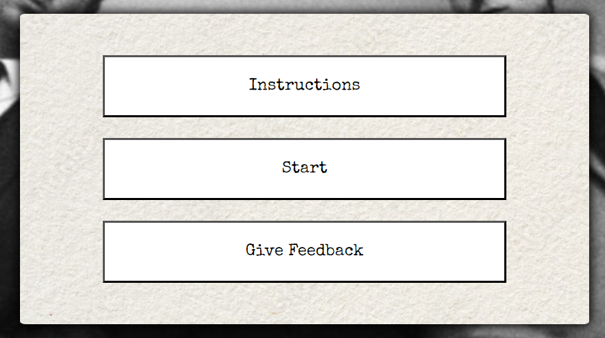
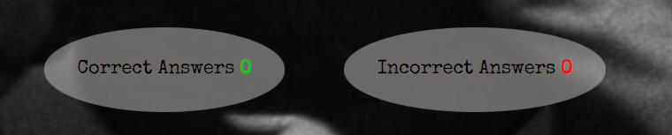
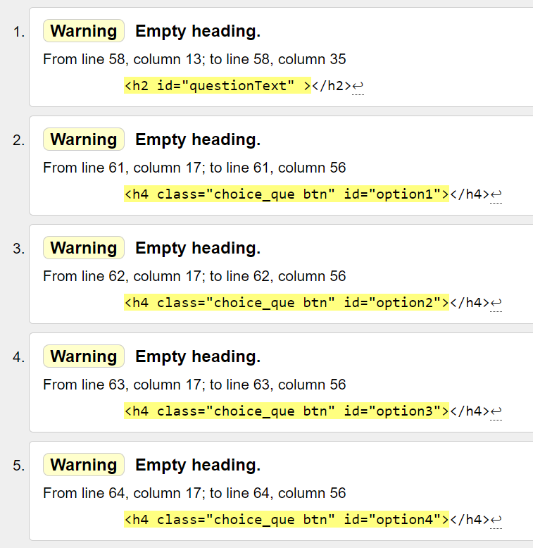
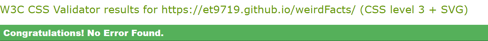
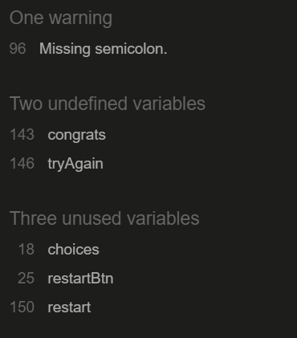

# Weird Facts Quiz

<!-- description of quiz -->

[Click here to go to the live website!](ADD LINK) 

## Table of contents

1. [Client Expectations](#client-expectations)
2. [User Expectations](#user-expectations)
3. [Wireframes](#wireframes)
    - [Start](#start)
    - [Instructions](#instructions)
    - [Feedback](#feedback)
    - [Quiz](#quiz)
    - [Results](#results)
    - [Mobile wireframes](#mobile-wireframes)    
4. [Features](#features)
5. [Testing](#testing)
    - [HTML](#html)
    - [CSS](#css)
    - [Bugs](#bugs)
6. [Deployment](#deployment)
7. [Credits](#credits)
    - [Content](#content)
    - [Media](#media)

## Client Expectations

## User Expectations

## Wireframes

### Start

### Instructions

### Feedback 

### Quiz 

### Results

### Mobile wireframes

## Features

### Logo
 - The Weird Facts Quiz logo was made on procreate by myself. I wanted a logo that would go well with the rest of the quiz. I had decided on using a font called 'Special Elite' for my quiz to make it look like it had been written on a typewriter, so I drew my logo with that in mind.

### The start area
 - This is the first page you see when the quiz loads. On this page there are three options, the first option being the instructions, second being start which activtes the quiz itself and the last option being Give feedback. Each of these options when clicked on will take you to their corasonding pages. 

### The Score area
 - The score area is shown at the bottom of the page, this is here so that the user can see how many questions they have got correct and how many are incorrect throughout the quiz.

## Testing

### HTML

HTML was tested using the official [W3C validator](https://validator.w3.org/nu/) 

The HTML results came back with no errors.
The following warnings were found:

- All warnings were showing empty headings. This is because they were left empty to allow different words to be placed inside the headings throughout the quiz using javaScript. 

### CSS
 
 CSS was tested using the official [(Jigsaw) validator](https://jigsaw.w3.org/css-validator/)
 
No errors were found in the css:

     

### JavaScript

JavaScript was tested using js hint [js hint validator](https://jshint.com/) 

The JavaScript results came back with the following:

1. A warning for a missing semicolon on line 96

- To resolve this I went to line 96 and placed the semicolon where needed.

2. It found two undefined variables, congrats on line 143 and tryAgain on line 146. 

- For both of these i worte a variable using getElementById to pull them from the html.

3. It found three unused variables, choices on line 20, restartBtn on line 27 and restart on line 153.

- choices was not needed so it was deleted.
- 

### Manual Testing 

Component | Function | Does it work? | Fixed? 
--------- | --------- | ----------------- | ------ |

I also carried out manual testing which tested the responsiveness of the website.
I have tested my site on the following devices:

- Moto G4
- Galaxy S5
- Pixel 2
- iphone 5/SE
- iphone 6/7/8
- iphone 6/7/8 Plus
- iPad
- ipad pro
<!-- - Desktop  -->

### Bugs

1. I found that when the user chose an answer, there seemed to be no limit on how many times they can make a choice on the same question before pressing the next button and therefore could add as many correct and incorrect points as they like on each questions.

- fixed? YES

- what did i do?
 
  To fix this i had to find a way to disable all choices when a user makes their first choice on each question.
  To do that I created a variable called answerDisable and gave it the value of false to start with. 
  In the function where i added a selected class to the choice the user selected, I added an if statement that says if answerDisabled is equal to true then return null. The null value removes and values the choice objects had disabling the use of them. right after the if statement in the userAnswer function I wrote answerDisable = true to put that if statement into use. 
  In the show next question function, when the next button is pressed, I put answerDisabled = false to allow the use of the choice buttons again for the next question. 

2.

-fixed? 

- what did i do ?

      

 ## Deployment

 The site was deployed to GitHub pages.

The steps to deploy are as follows:

- First, I created a new repository by clicking new in the GitHub repository menu
- I used the Code-institute-Org/gitpod-full-template and created a repository name.
- I continued by clicking in the create repository button at the bottom of the page.
- When it had been created, I then went to settings.
- Scrolled down to Github pages where it says "Pages settings now has its own dedicated tab! Check it out here!" And I followed the link.
- When on Github pages I selected the source to be the main branch and pressed save.
- A message then pops up that says, " Your site is ready to be published at Your site is published at ADD LINK and when clicked on will take you to the site. 

 ## Credits

 ### Content

1. https://gitpod.io/workspaces and https://github.com/ : were used to create the site

2.

3. 

 ### Media

1. : This was used to create the wireframes used to design the site.

2. 

3. 

