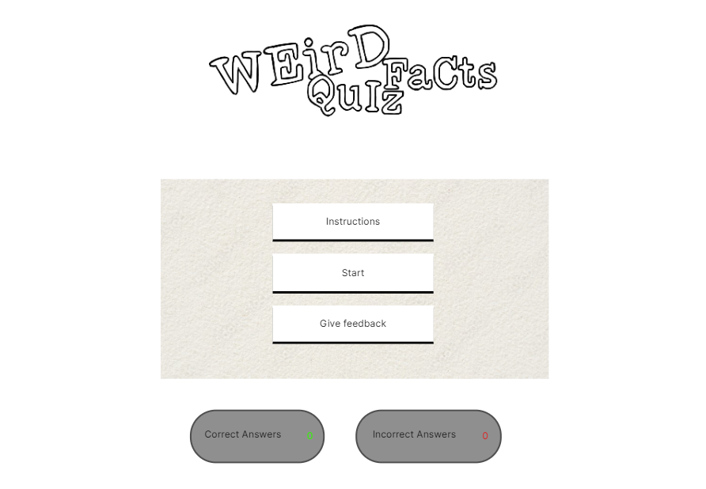
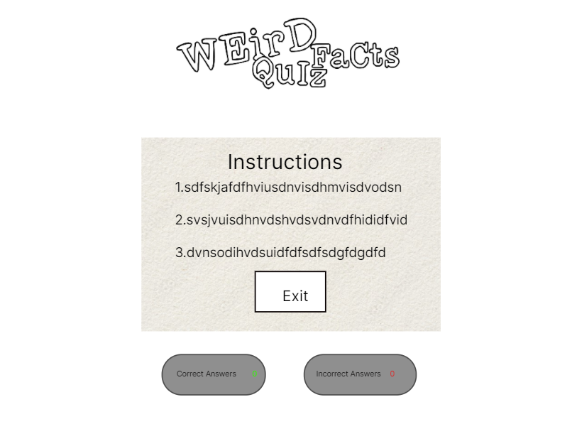
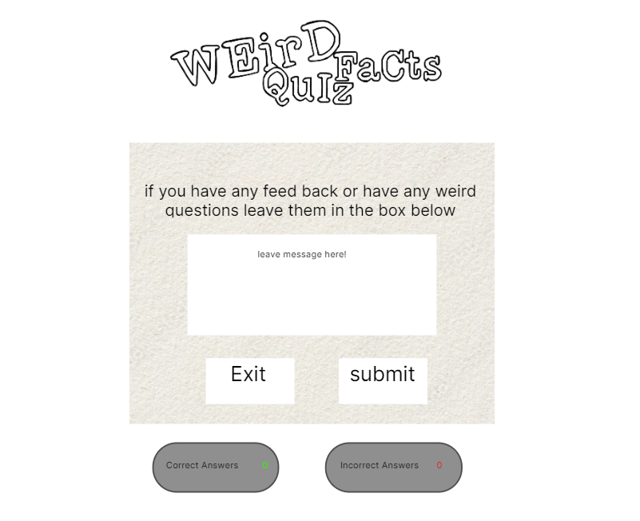
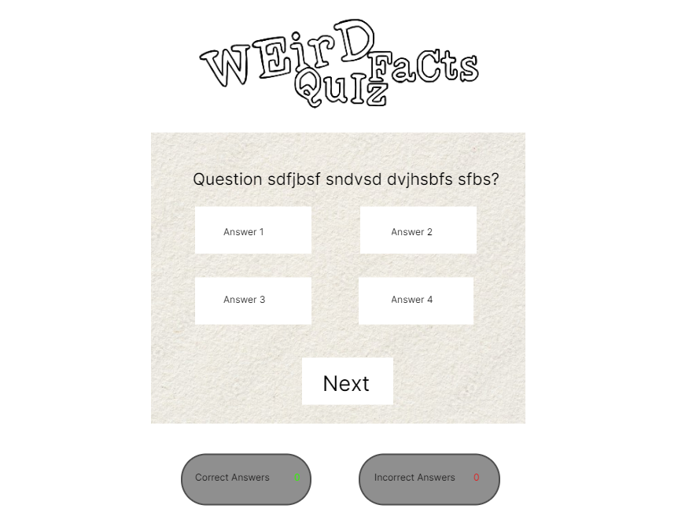
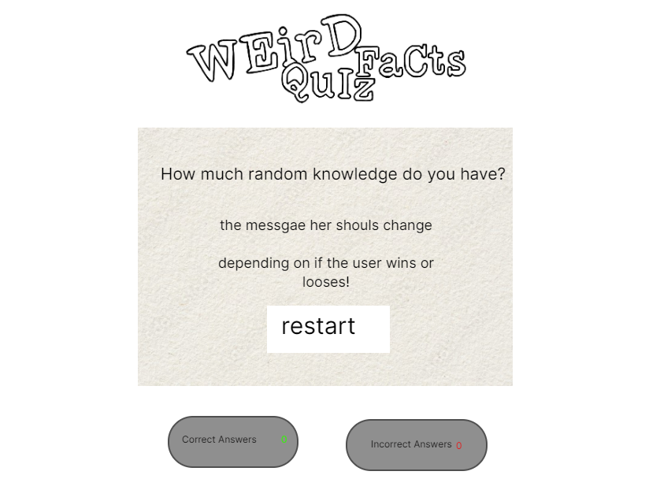
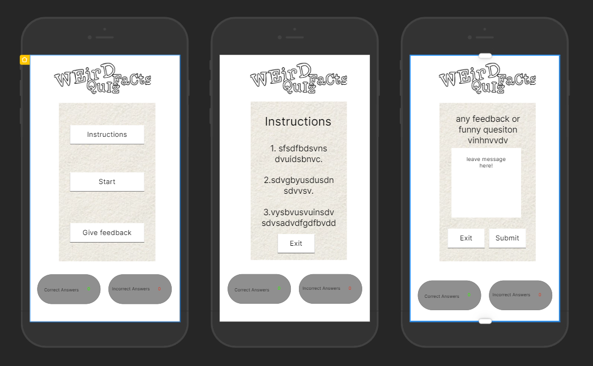
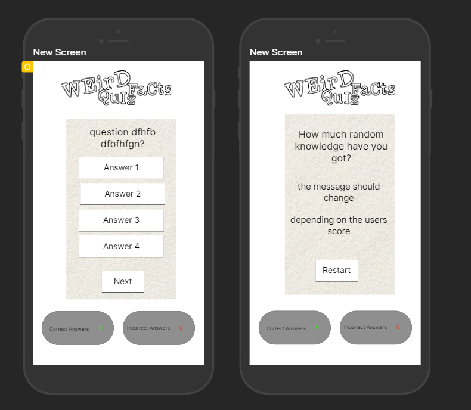

# Weird Facts Quiz

<!-- description of quiz -->

[Click here to go to the live website!](ADD LINK) 

## Table of contents

1. [Client Expectations](#client-expectations)
2. [User Expectations](#user-expectations)
3. [Wireframes](#wireframes)
    - [Start](#start)
    - [Instructions](#instructions)
    - [Feedback](#feedback)
    - [Quiz](#quiz)
    - [Results](#results)
    - [Mobile wireframes](#mobile-wireframes)    
4. [Features](#features)
5. [Testing](#testing)
    - [HTML](#html)
    - [CSS](#css)
    - [Bugs](#bugs)
6. [Deployment](#deployment)
7. [Credits](#credits)
    - [Content](#content)
    - [Media](#media)

## Client Expectations

## User Expectations

## Wireframes

### Start

### Instructions

### Feedback 

### Quiz 

### Results

### Mobile wireframes

## Features

## Testing

### HTML

HTML was tested using the official [W3C validator](https://validator.w3.org/nu/) 

The following errors/warnings were found:

-
Retested: Warning cleared

-
Retested: Error passed

The HTML was then re-tested, and results came back with no errors.

### CSS
 
 CSS was tested using the official [(Jigsaw) validator](https://jigsaw.w3.org/css-validator/)
 

errors found:

 

  Retested: Error Passed

  The CSS was then re-tested, and results came back with no errors.

     

### Manual Testing 

Component | Function | Does it work? | Fixed? 
--------- | --------- | ----------------- | ------ |

I also carried out manual testing which tested the responsiveness of the website.
I have tested my site on the following devices:

- Moto G4
- Galaxy S5
- Pixel 2
- iphone 5/SE
<!-- - iphone 6/7/8
- iphone 6/7/8 Plus
- iPhone X
- iPad
- ipad pro
- Desktop -->

### Bugs

1. 

- fixed? 

- what did i do ?

      

2.

-fixed? 

- what did i do ?

      

 ## Deployment

 The site was deployed to GitHub pages.

The steps to deploy are as follows:

- First, I created a new repository by clicking new in the GitHub repository menu
- I used the Code-institute-Org/gitpod-full-template and created a repository name.
- I continued by clicking in the create repository button at the bottom of the page.
- When it had been created, I then went to settings.
- Scrolled down to Github pages where it says "Pages settings now has its own dedicated tab! Check it out here!" And I followed the link.
- When on Github pages I selected the source to be the main branch and pressed save.
- A message then pops up that says, " Your site is ready to be published at Your site is published at ADD LINK and when clicked on will take you to the site. 

 ## Credits

 ### Content

1. https://gitpod.io/workspaces and https://github.com/ : were used to create the site

2.

3. 

 ### Media

1. : This was used to create the wireframes used to design the site.

2. 

3. 

