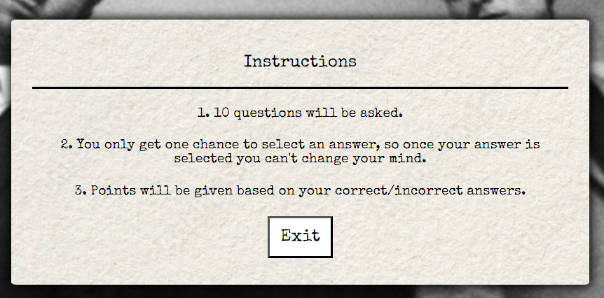
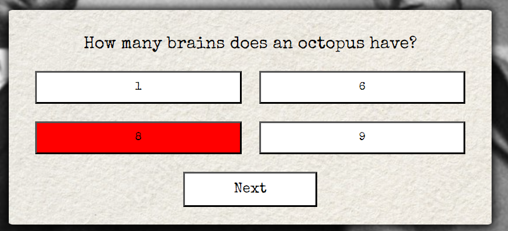
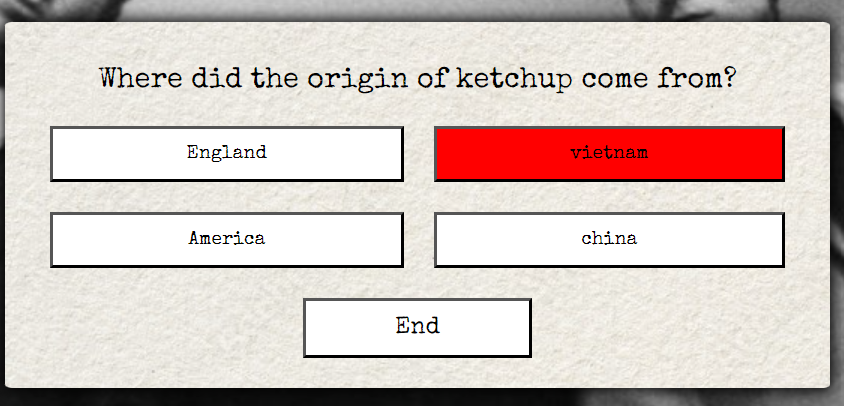
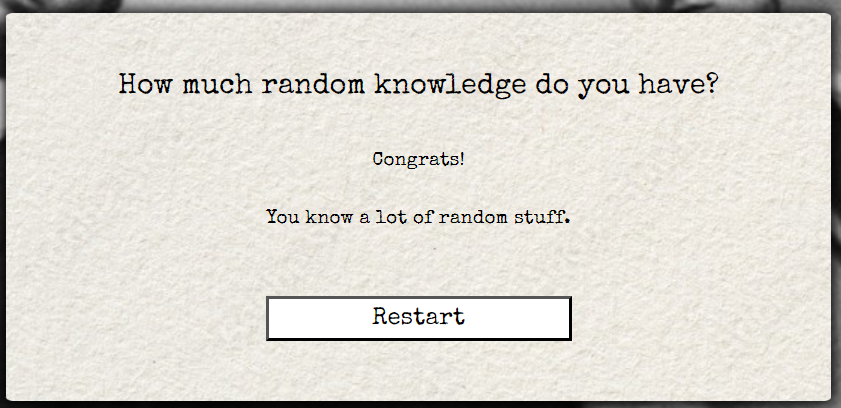
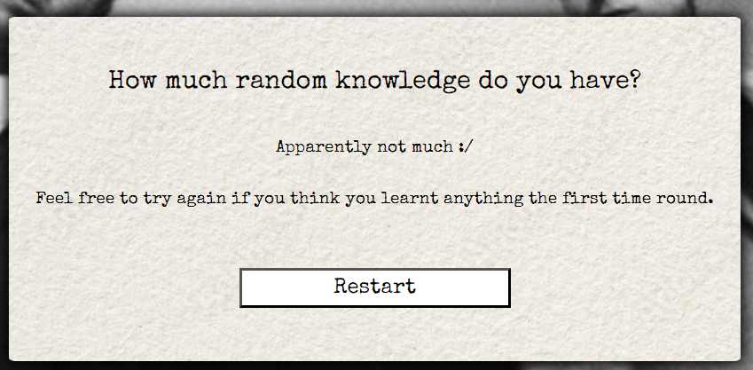
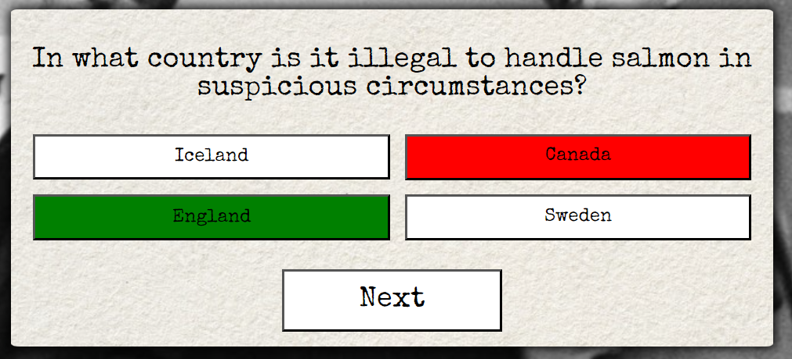
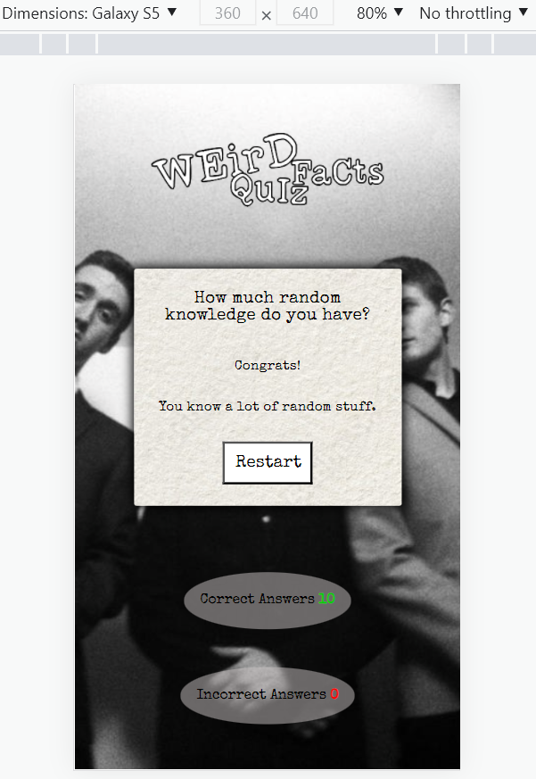

# Weird Facts Quiz

This website is aimed at people that love to learn weird and mostly unusual facts for fun! 
I got the idea from a friend that likes to give a random fact of the day every time we meet, it always makes me laugh... and doubt the fact to the point that I have to get on google and check it out for myself.
My goal is to create a functioning quiz using html, CSS and JavaScript that is responsive and fun for all people that have an interest in learning weird facts. 

[Click here to go to the live website!](https://et9719.github.io/weirdFacts/) 

## Table of contents

1. [User Expectations](#user-expectations)
2. [Wireframes](#wireframes)
    - [Start](#start)
    - [Instructions](#instructions)
    - [Feedback](#feedback)
    - [Quiz](#quiz)
    - [Results](#results)
    - [Mobile wireframes](#mobile-wireframes)    
3. [Features](#features)
    - [Logo](#logo)
    - [The start area](#the-start-area)
    - [The score area](#the-score-area)
    - [Instructions area](#instructions-area)
    - [Feedback area](#feedback-area)
    - [Quiz area](#quiz-area)
    - [Results sections](#results-sections)
4. [Changes from the original plan](#changes-from-the-original-plan)
4. [Testing](#testing)
    - [HTML](#html)
    - [CSS](#css)
    - [Bugs](#bugs)
5. [Deployment](#deployment)
6. [Credits](#credits)
    - [Content](#content)
    - [Media](#media)

## User Expectations

 - As a user, I want see a site that is clearly laid out.
 - As a user, I want clear instructions of how the quiz works.
 - As a user, I want the site to be interactive.
 - As a user, I want to be able to navigate through the quiz easily.
 - As a user, I want the site to be responsive on multiple devices.

## Wireframes

### Start

### Instructions

### Feedback 

### Quiz 

### Results

### Mobile wireframes

## Features

### Logo
 - I created the Weird Facts Quiz logo on procreate. I wanted a logo that would go well with the rest of the quiz. I had decided on using a font called 'Special Elite' for my quiz to make it look like it had been written on a typewriter, so I drew my logo with that in mind.

### The start area
 - This is the first page you see when the quiz loads. On this page there are three options, the first option being the instructions, second being start which activates the quiz itself and the last option being Give feedback. Each of these options when clicked on will take you to their corresponding pages. 

### The score area
 - The score area is shown at the bottom of the page, this is here so that the user can see how many questions they have got correct and how many are incorrect throughout the quiz.

### Instructions area
 - The instructions area is shown when instructions is clicked on the start page, it contains three simple instructions explaining how the quiz works followed by an exit button that will take you back to the start area.

 

### Feedback area
 - This area is a place where users can leave feedback or even other weird facts. They can do this by entering their text into the form and pressing submit underneath. There is also an exit button that will again take you back to the start area. 

 

### Quiz area
 - The quiz area is the space in which the questions are asked, and the user gives their answers. It consists of a question at the top and 4 answer choices. when the user clicks on a choice their choice will light up either red or green depending on if the answer they chose was correct or not. once a choice is made the score area underneath will be adjusted and the next button will pop up at the bottom under the answer choices. When the next button is pressed it will move onto the next question. 

 

 - When the user gets to the last question, the next button will be an end button instead as there will be no more questions for the user to answer. When they click on the end button is will take them onto one of two result sections. 

  

### Results sections
 - When the user gets to the end of the quiz, they will see either the congrats area if they get 5 or more questions correct, or they would see the try again area if they got less than 5 correct. These areas both have a little message to the user followed by a restart button that will reset the whole quiz and take them back to the start area. 

  

  

## Changes from the original plan 

- Originally, I had planned it out so that when the user clicks on an answer it will turn red or green depending on if they get it correct or not. I wanted to be able to teach the user the correct answer if they didn't get it right, so I added a function to allow the correct answer to also show if the user doesn't guess right.

  

## Testing

### HTML

HTML was tested using the official [W3C validator](https://validator.w3.org/nu/) 

The HTML results came back with no errors.
The following warnings were found:

- All warnings were showing empty headings. This is because they were left empty to allow different words to be placed inside the headings throughout the quiz using JavaScript. 

### CSS
 
 CSS was tested using the official [(Jigsaw) validator](https://jigsaw.w3.org/css-validator/)
 
No errors were found in the CSS:

     

### JavaScript

JavaScript was tested using js hint [js hint validator](https://jshint.com/) 

The JavaScript results came back with the following:

1. A warning for a missing semicolon on line 96

- To resolve this, I went to line 96 and placed the semicolon where needed.

2. It found two undefined variables, congrats on line 143 and tryAgain on line 146. 

- For both I wrote a variable using getElementById to pull them from the html.

3. It found three unused variables, choices on line 20, restartBtn on line 27 and restart on line 153.

- Choices was not needed so it was deleted.
- As restart is a function, and in the html I had onclick="restart(); the restartBtn variable was not needed so this was also deleted.

The JavaScript was then retested, it came back with nothing but the one unused variable 'restart', this is because it didn't pick up that it was used as an onclick function within the html.

### Manual Testing 

Component | Function | Does it work? | Fixed? 
--------- | --------- | ----------------- | ------ |
Start area: Instructions | Takes user to instructions area | Yes | N/A
Start area: Start | Takes user to quiz area | Yes | N/A
Start area: Give feedback | Takes user to feedback area | Yes | N/A
Instructions: Exit | Takes user back to start area | Yes | N/A
Feedback: Exit | Takes user back to start area | Yes | N/A
Feedback: Submit | Submits users feedback | Yes | N/A
Quiz: Answer buttons | change color to red/green depending on if answer is correct or not, implement score, show the next button | Yes | N/A
Quiz: Next | change color of all answer buttons back to white, show the next question/answers | Yes | N/A
Quiz: End | shows results section congrats if user scored 5+ or try again if user scored less than 5 | Yes | N/A
Congrats: Restart | resets score area and takes user back to start area | Yes | N/A
Try again: Restart | resets score area and takes user back to start area | Yes | N/A

I also carried out manual testing which tested the responsiveness of the website.
I have tested my site on the following devices:

- Moto G4
- Galaxy S5
- Pixel 2
- iphone 5/SE
- iphone 6/7/8
- iphone 6/7/8 Plus
- iPad
- ipad pro
- Desktop 

### Bugs

1. I found that when the user chose an answer, there seemed to be no limit on how many times they can make a choice on the same question before pressing the next button and therefore could add as many correct and incorrect points as they like on each question.

- fixed? Yes

- what did I do?
 
  To fix this I had to find a way to disable all choices when a user makes their first choice on each question.
  To do that I created a variable called answerDisable and gave it the value of false to start with. 
  In the function where I added a selected class to the choice the user selected, I added an if statement that says if answerDisabled is equal to true then return null. The null value removes and values the choice objects had disabling the use of them. right after the if statement in the userAnswer function I wrote answerDisable = true to put that if statement into use. 
  In the show next question function, when the next button is pressed, I put answerDisabled = false to allow the use of the choice buttons again for the next question. 

2. I found that when a user scores 10/10 on devices with a screen around 360px, the score area goes to block rather than inline.

- fixed? Yes

- what did I do ?
 
 I realised this was because by getting 10 rather than 9 or below there are two digits in the number. This meant that both correct and incorrect scores could no longer fit on the same line. 
 To fix it all I needed to do was lower the font size slightly. 

  

 ## Deployment

 The site was deployed to GitHub pages.

The steps to deploy are as follows:

- First, I created a new repository by clicking new in the GitHub repository menu
- I used the Code-institute-Org/gitpod-full-template and created a repository name.
- I continued by clicking in the create repository button at the bottom of the page.
- When it had been created, I then went to settings.
- Scrolled down to Github pages where it says "Pages settings now has its own dedicated tab! Check it out here!" And I followed the link.
- When on Github pages I selected the source to be the main branch and pressed save.
- A message then pops up that says, " Your site is ready to be published at Your site is published at https://et9719.github.io/weirdFacts/ and when clicked on will take you to the site. 

 ## Credits

 ### Content

1. https://gitpod.io/workspaces and https://github.com/ : were used to create the site

2. I watch multiple videos on YouTube to help me get an idea of how to make the quiz, here are some of the videos I got inspiration from: 
[Build A Quiz App With JavaScript, web dev simplified](https://www.youtube.com/watch?v=riDzcEQbX6k) 
[How to Make a Quiz App using HTML CSS Javascript - Vanilla Javascript Project for Beginners Tutorial, Brian Design](https://www.youtube.com/watch?v=f4fB9Xg2JEY)
[How To Make Quiz App With Timer Using HTML CSS & JavaScript, Code Now](https://www.youtube.com/watch?v=f4fB9Xg2JEY)

3. Id also like to thank my mentor Marcel and also other students like Matt Bodden for their support and encouragement throughout this project.

 ### Media

1. https://uizard.io/ : This was used to create the wireframes used to design the site.

2. Procreate : This app was used to make the weird facts logo.

3. https://stock.adobe.com/ : This is where I found the image of paper for the container.

